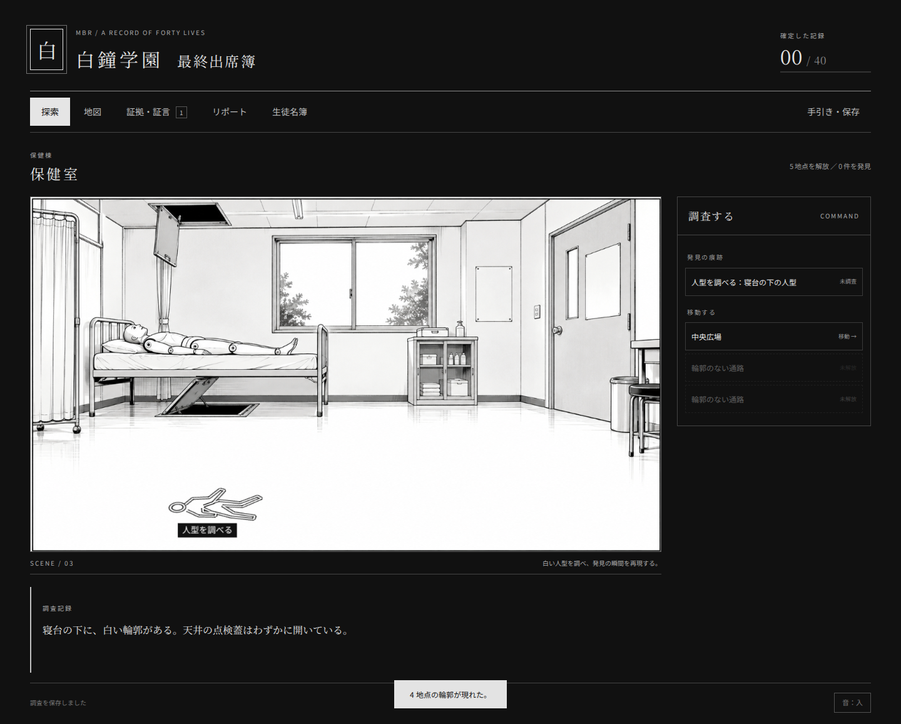
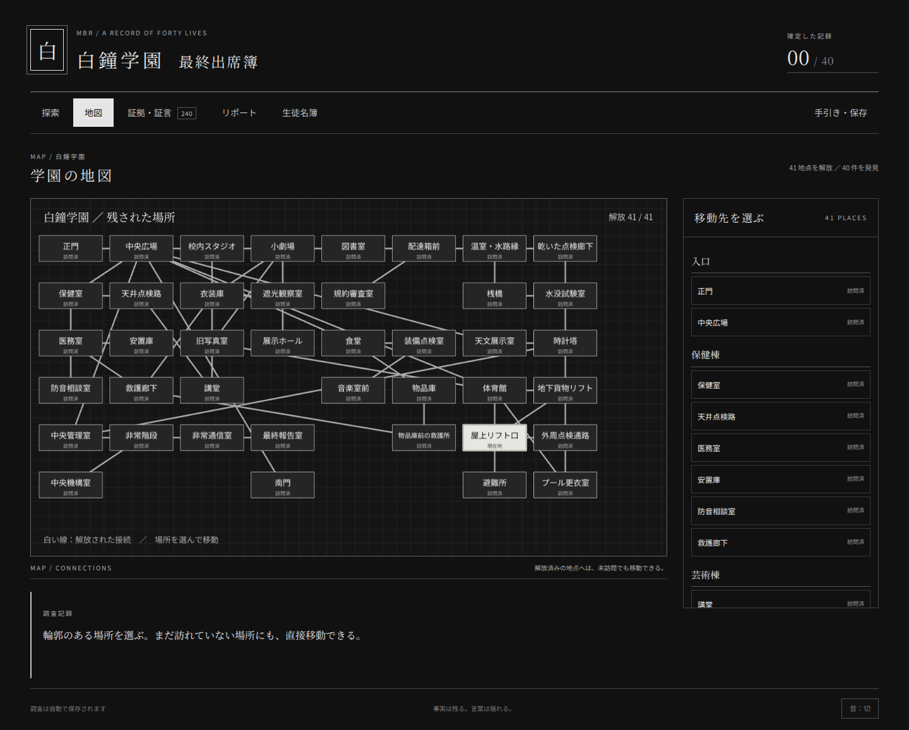

# MBR — 白鐘学園・最終出席簿

証拠と証言を手掛かりに、四十人の生徒の最期を調べるコマンド選択型ミステリーです。HTML・JavaScript・Phaser 3で実装しています。

[ブラウザで遊ぶ（GitHub Pages）](https://tomtomyoung.github.io/MBR/)



## 起動

Node.js 22以上を使用します。

```sh
npm ci
npm run dev
```

表示されたローカルURLをブラウザで開いてください。index.htmlを直接ダブルクリックする方式ではありません。

## 遊び方

1. 正門の調査資料を調べ、場所を解放します。
2. 移動コマンド、または白黒地図で場所を選びます。解放済みなら未訪問でも地図から移動できます。
3. 白い人型を調べ、発見の瞬間を再現します。最後まで再生すると証言を記録します。
4. 周囲の痕跡を調べます。発見・再現後に調べられる項目もあります。
5. 証拠と証言を事件別、人物・発言時刻順で照合します。
6. 被害者、死因、凶器の個体、加害者をリポートへ記入します。任意の正解三件ごとに確定し、最後の一件は単独で照合します。

自動保存に加えて、手引きからセーブの書出し・読込みができます。音は初期無効です。マウス、タッチ、Tab・Enterで操作できます。

## 収録内容

41地点、40事件、43個の人型、123件の証拠、117件の証言、40人の名簿、全件確定後の結末を収録しています。証拠・証言による解放はリポートの正解に依存しません。終盤の無人の現場、同地点の複数事件、移送された遺体、複数地点に分かれた人型も扱います。

地点画は8枚の漫画調PNGと、未制作33地点を補う白黒SVGです。旧SVG41枚も保持しています。音はBGM4曲・環境音2種・効果音18種を収録し、音ONで場面に応じて再生します。人の台詞の音声収録は含みません。素材の配置記録は[inbox/ASSET_PLACEMENT.md](inbox/ASSET_PLACEMENT.md)、不足一覧は[inbox/MISSING_ASSETS.md](inbox/MISSING_ASSETS.md)を参照してください。

## ビルドと検証

```sh
npm test
npm run build
npx playwright install chromium
npm run test:browser
npm run docs
```

npm run buildでdistへ静的ファイルを出力します。相対パスでビルドするためサブディレクトリにも配置できます。npm run previewでビルド結果を確認できます。

mainへの更新は、テスト・資料整合性・ビルド・ブラウザ操作検査に成功するとGitHub Pagesへ自動公開します。初期設定と再公開の手順は[公開手順](doc/DEPLOYMENT.md)を参照してください。



## 資料と編集

[資料の入口](doc/README.md)、[確定仕様](doc/design/SPEC.md)、[全事件本文](doc/scenario/PLAYABLE_CASES.md)、[地点と解放条件](doc/scenario/NODES.md)、[実装状況](doc/STATUS.md)を参照してください。事件本文と正解にはネタバレが含まれます。

src/data/case-text.jsは手作業で書いた発見再現と証拠の本文、world.jsは空間と解放条件、game.jsはゲーム用の関係、solutions.jsは採点用正解です。engine.jsが進行を管理し、scene.jsがPhaserで地点と地図を描き、main.jsがコマンド・手帳・リポートを扱います。

npm run docsは実装データから資料を更新します。node scripts/create-scenes.jsは地点画を再生成するので、手描きで差し替えた画像を保持したい場合は実行しないでください。
